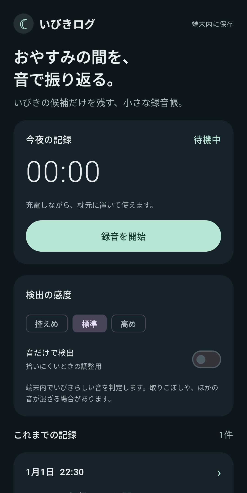
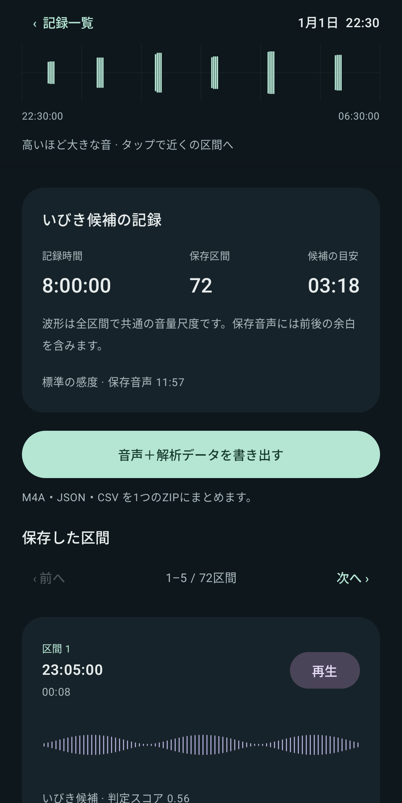
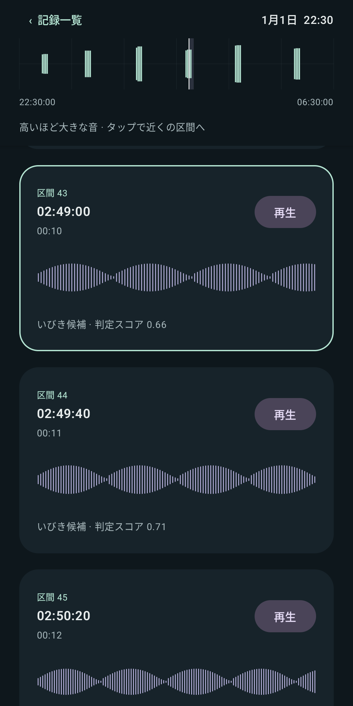

# Ibiki Logger

[日本語](README.md) | [English](README.en.md)

The [Japanese README](README.md) is the authoritative source. This English version is provided for convenience. If the two versions differ, the Japanese version takes precedence. This policy applies only to the README; it does not modify or override the original texts of `LICENSE` or third-party licenses.

An offline overnight audio recorder for Pixel 10 Pro XL / Android 17. Recording and sound classification run entirely on the device.

This app is an early preview. Short recording sessions, waveform display, and export have been tested on a physical device. Detection accuracy during sleep, overnight battery use, and overnight stability have not yet been evaluated. See the [verification notes (Japanese)](docs/verification.md) for the scope of testing.

## Screenshots

These are actual app screens captured with a fixed demo dataset. The recordings, waveforms, and scores shown are synthetic examples. The app UI is currently available only in Japanese.

<table>
  <tr><th>Recording home</th><th>Session overview</th><th>Jump to a clip</th></tr>
  <tr>
    <td></td>
    <td></td>
    <td></td>
  </tr>
</table>

Both language versions share the same images. When the UI changes, recapture them using the same filenames. See [updating the screenshots (Japanese)](docs/screenshots.md).

## Features

- Start before bed and continue recording with the screen off.
- Use on-device YAMNet to detect possible snoring and save clips with about two seconds of context on either side. Audio from quiet periods is not saved.
- Review a timeline of the whole night, individual waveforms, and playable clips.
- Keep the volume timeline fixed at the top of the detail screen. Tap a time to jump to the nearest saved clip.
- Browse up to five clips per page. Previous/next buttons mark the first clip on the destination page with a white line. Tapping the timeline opens the appropriate page and marks the selected clip.
- Export AAC / M4A audio and JSON / CSV analysis data together as a ZIP archive.
- Record microphone interruptions separately from silence.
- Choose from three sensitivity levels. The “Sound only” adjustment mode also captures speech and environmental sounds above the volume threshold.
- Delete individual sessions. No network connection or login is required, and audio is not automatically uploaded to a cloud service.
- Optionally play Wabigashi Fumi's “にゃーにゃーにゃー” as background music. The track is bundled in the APK and can play offline.

The Android application ID and namespace are **`com.kyanro.ibiki_logger`**, following the same naming convention as `com.kyanro.sim_speed_viewer`. No website or DNS configuration is required for this identifier. Play Store distribution and signing-key management are separate tasks.

## Your first night

1. Place the phone near your pillow with its microphone unobstructed. Keep it charging while using this early version.
2. Start with standard sensitivity (**標準**) and leave “Sound only” (**音だけで検出**) off.
3. Tap “Start recording” (**録音を開始**) and allow microphone access and recording notifications. You can turn the screen off.
4. In the morning, stop recording in the app or from the notification. Open the session to review its waveforms and listen to clips.
5. Tap “Export audio + analysis data” (**音声＋解析データを書き出す**) and save the ZIP to Downloads or another location. You can transfer it to a computer by USB or another method.

Detections are candidates: the app can miss snoring or capture other sounds. It cannot distinguish your snoring from another person's in the same room. The candidate-duration estimate adds up positive detection windows; it is not a precise measurement of actual snoring duration. Keep the phone in the same position when comparing nights.

A recording session can last up to 12 hours. Interruptions, microphone silencing, and low storage are recorded. If the app is forcibly terminated, up to about 30 seconds of recent metadata and any clip not yet saved may be lost.

## Export format

| File | Contents |
| --- | --- |
| `audio/*.m4a` | AAC-LC, 16 kHz, mono, target 32 kbps. About 14.4 MB per hour of saved audio, plus metadata |
| `session.json` | UTC session start, device, settings, status, interruptions, all clips, and waveforms |
| `clips.csv` | Audio filename, offset from session start, UTC timestamp, duration, and detection score |
| `waveform.csv` | Peak and RMS values for each 100 ms frame, measured before audio compression |
| `README.txt` | Field definitions and interpretation notes |

Timestamps refer to the original session, not to a recording with silent periods removed. RMS is expressed in dBFS relative to digital full scale, not calibrated sound pressure in dB SPL. Waveforms use a common logarithmic scale across all clips.

The detail-screen overview aggregates saved 100 ms peak values on the original session timeline. When multiple values share a display column, it uses the maximum so that brief sounds remain visible. Tapping an empty area selects the nearest saved clip. Recordings from version 0.1.2 and earlier can be displayed without changing their storage format.

Internally, waveform data is kept in separate immutable files for each clip, avoiding repeated writes of all waveform data during recording. Model inference runs about every 0.5 seconds when sound exceeds the volume threshold, and screen updates are limited. Continuous microphone monitoring and CPU activity are still required; actual overnight battery use has not yet been measured.

## LiteRT and YAMNet

| Component | Role | Use in this app |
| --- | --- | --- |
| [LiteRT](https://developers.google.com/edge/litert) | Google's framework for running trained AI models on a device, built on TensorFlow Lite | Version 1.4.2 is bundled in the APK and runs YAMNet with one CPU thread |
| [YAMNet](https://www.tensorflow.org/hub/tutorials/yamnet) | Google's pretrained model for classifying 521 kinds of sound, including speech, music, animal sounds, and snoring | An approximately 4 MB model is bundled; the app uses its `Snoring` score |

The flow is: microphone audio → volume check → YAMNet inference through LiteRT → save intervals above the selected snoring-score threshold, with context, as M4A clips.

The model receives approximately one second of 16 kHz mono audio (15,600 samples). It runs about every 0.5 seconds when sound is present, so input windows overlap. In quiet periods, inference is skipped while microphone monitoring continues. GPU and NPU acceleration are not currently used.

Both the model and runtime are on the device. Recording and classification require no network connection, API key, or cloud inference fees. The app neither sends recordings to an external service nor uses them to further train the model.

YAMNet is a general-purpose sound classifier and does not guarantee snoring-detection accuracy in this app. A score is not a probability: for example, 0.8 does not mean an 80% chance of snoring. Review actual clips when adjusting sensitivity and phone placement.

The main license for LiteRT and the bundled YAMNet model is Apache License 2.0. Original notices and license texts are retained, including the BSD-style notices accompanying LiteRT. See the [third-party notices](THIRD_PARTY_NOTICES.md) and [dependency-license review (Japanese)](docs/dependency-licenses.md).

## Development

Kotlin / Jetpack Compose, compileSdk and targetSdk 37, minSdk 29, AGP 9.2.1, and Gradle 9.4.1. Dependency versions are fixed. Model provenance, hashes, and licensing are documented in [THIRD_PARTY_NOTICES.md](THIRD_PARTY_NOTICES.md).

Requirements: Android SDK, JDK 17 or later, and the [official Android CLI](https://developer.android.com/tools/agents/android-cli/download). This development environment uses the JDK bundled with Android Studio; Gradle resolves JDK 17 for the build toolchain.

```powershell
# Build, unit tests, and static checks
.\scripts\build.ps1

# Install and launch on one device with USB debugging authorized
.\scripts\install.ps1
```

The scripts look for Android CLI at `.tools/android.exe` or on `PATH`. Build caches use `.tools/gradle-home`. Set `JAVA_HOME` / `ANDROID_HOME` as needed for your computer. The app scaffold was generated with `android create`. Gradle compiles the sources; `android run --apks=...` installs and launches the APK; `android screen capture` / `android layout` were used to inspect the device UI.

Run instrumented tests only when the device is not recording. `connectedDebugAndroidTest` may uninstall the app after testing, so export important sessions first if you use that task on a device containing recordings.

See [docs/verification.md (Japanese)](docs/verification.md) for completed checks and measurements still needed.

Recorded audio, personal measurement data, development tools, and build outputs are not committed to Git. The bundled music is managed with its rights notice. README images are generated using a separate capture app and fixed demo data, then stored in `docs/images/`.

## Fumi's song

Use the “Play BGM” (**BGMを再生**) button at the bottom of the home screen to listen to Wabigashi Fumi / OTOGI SHIFT's [“にゃーにゃーにゃー”](https://otogishift.com/songs/nyaa-nyaa-nyaa/). The same recording is bundled in sim-speed-viewer.

Music is off by default. When enabled, it loops at a low volume while the app screen is open. It stops when recording begins, the screen turns off, you switch to another app, or audio is interrupted by a call or a similar event. It does not resume automatically after recording stops or when you return to the app. BGM cannot play while recording. You can also adjust its volume using the phone's media-volume control.

The song-page button opens an external browser. Recording and BGM playback inside the app work offline.

## A small “nyaa” request from the author — not a license condition

This is a playful, optional request. It is not a legal obligation. Ignoring it does not affect your rights to use, modify, or redistribute the code and documentation under Apache License 2.0.

- If you build this app, please consider listening to Wabigashi Fumi's [“にゃーにゃーにゃー”](https://otogishift.com/songs/nyaa-nyaa-nyaa/) at least once.
- If you enjoy the song, try the app's BGM button before recording or while reviewing your morning results.

It would make the author happy. Nyaa!

## License

Copyright 2026 kyanro

Source code and documentation are provided under the [Apache License 2.0](LICENSE), the same as sim-speed-viewer. The bundled recording is excluded from that license. See [ASSET_LICENSES.md](ASSET_LICENSES.md) for music rights and [THIRD_PARTY_NOTICES.md](THIRD_PARTY_NOTICES.md) for YAMNet and other bundled components.

These license documents are also included in the APK and can be read from “Licenses and credits” (**ライセンスとクレジット**) in the app.

The main external dependencies are AndroidX / Jetpack Compose for the UI and Android integration, LiteRT for inference, YAMNet for sound classification, and the Kotlin standard library and Coroutines. Their main licenses are Apache 2.0, but LiteRT and Kotlin also contain portions covered by BSD-style or Boost 1.0 terms. Those notices and license texts are bundled as well. This app's code and documentation are offered under Apache 2.0 while preserving third-party rights.

The reviewed dependencies and review scope are recorded in [docs/dependency-licenses.md (Japanese)](docs/dependency-licenses.md).
